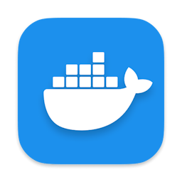

# 👋 Hi, I’m Denny

I'm a software developer who's excited by the prospect of building tools that others find useful. I'm very interested in testing and Agile methodologies. I've written and iterated on automated tests for my personal projects, making several improvements as I've learned more.

- [My Stack](#my-stack)
- [My Projects](#my-projects)
  - [Birddex](#birddex)
  - [Calends](#calends)
  - [Portfolio](#portfolio-project)
  - [Chat-12](#chat-12)
  - [Lawn Mower](#lawn-mower)
- [About Me](#about-me)
- [How to Reach Me](#how-to-reach-me)

### My Stack
> `Languages` 
> </img>
> </img>
> </img>
> </img>
> </img>

> `Web Core` 
> </img>
> </img>
> </img>

> `Frameworks` 
> </img>
> </img>
> </img>
> </img>

> `Tools` 
> </img>
> </img>
> </img>
> </img>
> </img>

### My Projects

#### Birddex
> `A lifelist app for birders` 
> [Live Site](https://canarydevs.github.io/birddex) 
> [Gitlab Repo](https://gitlab.com/canarydevs/birddex) 
> We deliver a single-page application on the front end using React and a backend API using FastAPI. Data is managed by a PostgreSQL database. The Birddex repo contains several design diagrams and our project journals.
>
> I integrated Azure blob storage in order to allow users to upload their own images to the site.
>
> Topics: Dynamic Rendering Web Page, User Authentication, API, SQL Database, Automated Testing

#### Calends
>  `A syllabus-building utility for professors` 
> [Live Site](https://calends.proficientdr.com) 
> [Github Repo](https://www.github.com/jonalfarlinga/calends-lite) 
> This project uses a React front end hosted on Azure Storage and Azure Functions to serve the backend API. The business logic involves scraping html for data, then building a dictionary containing dates that can be rendered in HTML as a table-style calendar.
>
> This project was originally using Django backend. I rebuilt the backend in FastAPi, and at the same time switched from a `create-react-app` front end to `Vite`. I then rebult the backend for Azure Functions.
>
> Topics: Web-scraping, Dynamic Rendering Web Page, API

#### Portfolio Project
> `My cloud-hosted resume and portfolio page` 
> [Live Site](https://portfolio.denny-buklin.net) 
> [Github Repo](https://www.github.com/jonalfarlinga/portfolio) 
> Following the Cloud Resume Challenge, I created my portfolio as a full stack app using Azure Storage hosting and Azure Functions. I used HTMX to build the single-page application with page updates served as strings from the Azure functions API.
>
> Topics: HTMX, Dynamic Rendering Web Page, API, Azure Function App

#### Chat-12
> `An instant messaging app for developers` 
> Work in progress 
> [Gitlab Repo](https://www.gitlab.com/base-12/chat-12) 
> We built an API using Flask with a persistant database using MongoDB. In the next phase we will build a front end using React and websockets.
>
> I created unit tests for the database interface. In the first iteration, the tests were tightly coupled by mocking to the tested code. To fix this, I created Pytest fixtures that start an in-memory Mongo database for proper interations during test.
>
> Topics: Flask, MongoDB, Data Design, Automated Testing

#### Lawn Mower
> `A system utility to keep the desktop clean`
> [Github Repo](https://www.github.com/jonalfarlinga/lawn-mower)
> I wrote this script to keep my computer desktop clean. I wrote an install batch file that sets the target directory and the desktop locations, and I created a run batch file that starts the script as a background process.
>
> The running script moves all files off the desktop every two minutes.
>
> Topics: File System Manipulation, Task Scheduling, Shell scripting

### About me
As a high school student, my fascination with software development sparked a lifelong passion for software development. Despite career detours, my affinity for problem solving has remained unwavering. I thrive on collaborative projects and effective project management, orchestrating cohesive workflows for optimal outcomes. Transitioning towards software development aligns with my pursuit of happiness and productivity, fueling my daily quest for discovery and problem-solving.

My approach to my work emphasizes practicality, prioritizing functionality while maintaining adherence to standards and best practices. Outside of software, my experiences as a sailor taught me valuable lessons in holistic thinking and adaptability, mirroring my approach to project management.

Looking ahead, I aspire to design impactful systems that aid people regardless of scale, aiming to be a reliable support figure and providing assistance when needed. In essence, I am driven by a relentless pursuit of knowledge, blending technical expertise with a collaborative spirit and a passion for crafting solutions that truly make a difference.

### How to Reach Me
- 📫 Connect on GitHub or [LinkedIn](www.linkedin.com/in/dennis-bucklin)
- ⛵ Check out my [portfolio](portfolio.denny-bucklin.net)
